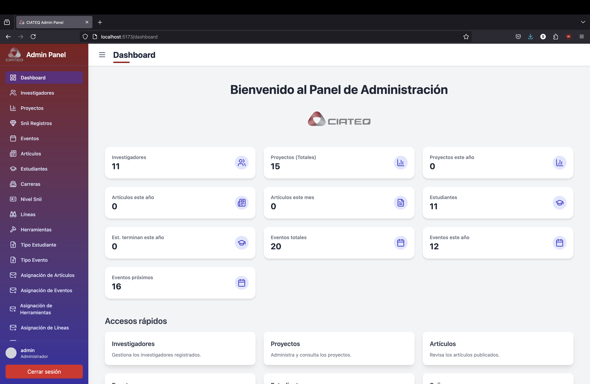
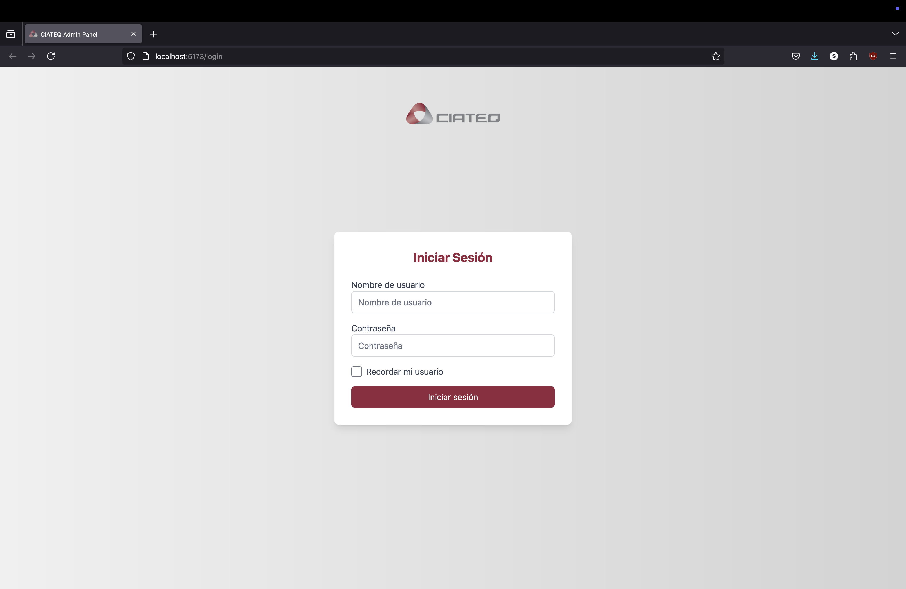
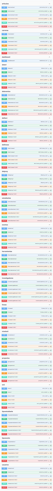

# Proyecto CIATEQ Investigadores

Este proyecto consiste en una plataforma web para la **gestión de investigadores, proyectos, estudiantes, publicaciones y eventos** dentro de un centro de investigación.



---

## 🚀 Tecnologías utilizadas

### Backend

- **NginX** (TODO)
- **Python _3.13_** con:
  - Django 5.1.7
  - djangorestframework
  - django-filter
  - django-cors-headers
  - djangorestframework_simplejwt

### Frontend

- **Node _v23.7.0_ y NPM _10.9.2_** con:
  - React usando Vite _6.2.0_
  - Tailwind CSS _4.0.15_
  - Lucide React Icons 

---

## 🗄️ Base de datos

### Estructura de la base de datos

Para entender la estructura de la base de datos, aqui está el diagrama Entidad Relacion del mismo.


---

## ⚙️ Instrucciones para desarrollo

### 💾 Backend (Django API)

1. Crear un entorno virtual (opcional pero recomendado):

```bash
python -m venv env
source env/bin/activate  # o env\Scripts\activate en Windows
```

2. Instalar las dependencias:

```bash
pip install -r requirements.txt
```

3. Configurar la base de datos en `backend/main/settings.py` según tus credenciales locales:

```python
DATABASES = {
    'default': {
        'ENGINE': 'django.db.backends.postgresql',
        'NAME': 'nombre_basededatos',
        'USER': 'usuario',
        'PASSWORD': 'contraseña',
        'HOST': 'localhost',
        'PORT': '5432',
    }
}
```

4. Aplicar migraciones:

```bash
python manage.py migrate
```

5. Crear los archivos para comandos personalizados:
En la carpeta de tu aplicación Django, crea las siguientes carpetas y archivos:

```bash
app/
└── management/
    └── commands/
        └── seed_data.py
    └── __init__.py
└── __init__.py
```

El script del seeder se encuentra en la ruta raiz del projecto, y lleva el nombre de `seed_data.py`

6. Ejecutar el comando para sembrar los datos iniciales:

```bash
python manage.py seed_data
```

7. Iniciar el servidor backend:

```bash
cd backend
python manage.py runserver
```

8. La API estará disponible en:

```
http://127.0.0.1:8000/
```

---

### 🖌️ Frontend (React)

1. Ir a la carpeta del frontend:

```bash
cd frontend
```

2. Instalar las dependencias:

```bash
npm install
```

3. Iniciar el servidor de desarrollo:

```bash
npm run dev
```

4. La aplicación estará disponible en:

```
http://localhost:5173/
```

---

## 👤 Credenciales de usuarios de prueba:

**Admin**
- Usuario: admin
- Contraseña: tecmilenio

**Usuario comun**
- Usuario: prueba
- Contraseña: 123



---

## 📦 Despliegue en producción con Gunicorn + Nginx
🔧 Requisitos

Ubuntu Server 24.04.2 <br> 
Python 3.13, PostgreSQL, Gunicorn, Nginx

### Backend con Gunicorn:
  1. Instalar Ubuntu (recomendadamente server edition) en maquina de despliegue o en maquina virutal (se recomienda usar VirtualBox de Oracle).
  2. Clonar el repositorio por medio de un `git clone`
  3. Una vez instalado el sistema operativo, instalar python 3.13 junto con pip y venv de sus respectivas versiones.
  ```bash
  sudo apt install python3.13 python3.13-pip python3.13-venv
  ```
  Después, se recomienda hacer los passos anteriormente mencionados para crear el virutal enviroment desde la carpeta raiz del proyecto. <br><br>
  4. Instalar postgresql.
  ```bash
  sudo apt install postgres
  ```
  5. Cambiar de usuario, y hacer un cambio de contraseña del usuario
  ```bash
  sudo su postgres
  passwd # Este comando cambiará la contraseña del usuario
  ```
  Tambien se recomienda iniciar `psql` y cambiar la contraseña del usuario por medio de una query.
  ```sql
  ALTER USER postgres WITH PASSWORD 'tuContraseña';
  ```
  Una vez cambiada la contraseña, nos salimos de la sesión del usuario de postgres con el siguiente comando:
  ```bash
  exit
  ```
  Asegurate de que las credenciales de la base de datos coincidan con las establecidas en el settings.py de django.

  6. Dentro del venv, instala las librerias especificadas en el archivo `requirements.txt` como se especifica en la parte superior del documento.

  7. Hacer migraciones de django a postgresql:
  ```bash
  python manage.py migrate
  python manage.py seed_data
  ```
  8. Una vez el proyecto funciona, se puede comenzar a inicializar **Gunicorn**.<br><br>
  Lo primero que se tiene que hacer, es abrir el archivo gunicorn-example.service y establecer las variables del servicio para que correspondan a tu proyecto.
  algunas variables que podrías cambiar, son las de **User**, **WorkingDirectory**, **ExecStart** (para establecer la cantidad de workers que usarás), entre otros
  Un archivo de prueba, se encuentra en la raiz del proyecto.
  9. Una vez el archivo está correctamente definido, moverlo a `/etc/systemd/system`, e iniciar el servicio con systemctl:
  ```bash
  sudo systemctl daemon-reexec
  sudo systemctl start gunicorn-example
  sudo systemctl enable gunicorn-example
  ```

## Frontend con NginX:
  1. Realizar la build del frontend:
  ```bash
  npm run build
  ```
  El comando dará como resultado una carpeta con los archivos estaticos previamente compilados para poder usar en la pagina web.

  2. Se tendrá que crear la carpeta `frontend` en la ruta `/var/www` con el siguiente comando:
  ```bash
  sudo mkdir /var/www/miapp-frontend
  ```
  Después de terminar esto, se tendrá que copiar los archivos generados por ```npm run build``` a la carpeta previamente especificada

  3. Se tiene un archivo llamado miapp en la capeta raiz del proyecto, ese archivo lo vamos a mover a la carpeta de `/etc/nginx/sites-available/miapp`, y enlazar las dos carpetas con el siguiente comando: 
  ```bash
  sudo ln -s /etc/nginx/sites-available/miapp /etc/nginx/sites-enabled/
  ```
  4. Finalmente, ejecuta los siguientes comandos:
  ```bash
  sudo nginx -t
  sudo systemctl restart nginx
  python manage.py collectstatics #Esto se hace desde el backend del proyecto.
  ```

  ## Resultado final:
  La pagina podrá ser visualizada desde la ruta `http://localhost`

  ---

## 📍 Endpoints disponibles de la aplicacion:
A continuación, se mostrarán todos los endpoints que se tienen para la aplicación:
